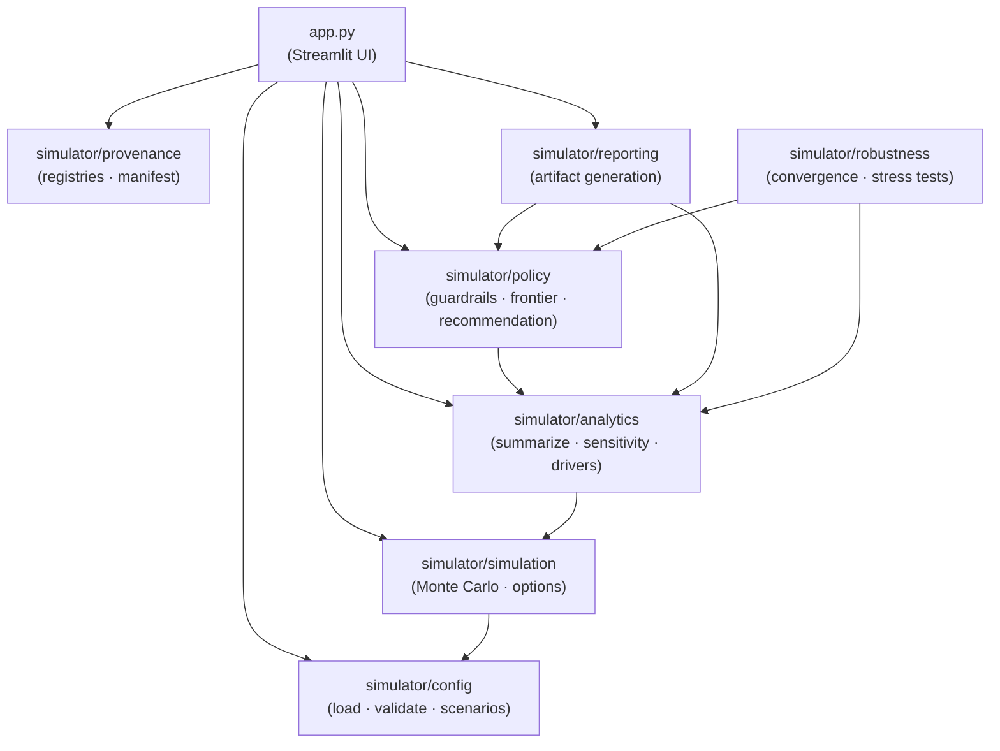

# Product Decision Under Uncertainty
[](https://github.com/tomasz-solis/product-decision-under-uncertainty/actions/workflows/ci.yml)

This repo is a small decision-analysis case study built around one product-platform choice, one synthetic published example, and one reproducible artifact pipeline.

In the current published run, `Stabilize Core` is the recommendation. No option clears both guardrails, so the policy falls back to expected value and `Stabilize Core` leads the field on that measure.

## Scope and evidence

There is no private company telemetry here. What is here is the assumption chain: modeled inputs, policy thresholds, dependencies, scenario overrides, and the evidence contract for future public data.

- Assumption provenance: [simulator/parameter_provenance.md](simulator/parameter_provenance.md)
- Parameter registry: [simulator/parameter_registry.yaml](simulator/parameter_registry.yaml)
- Non-parameter assumption registry: [simulator/assumption_registry.yaml](simulator/assumption_registry.yaml)

## What is in the repo

- A Monte Carlo simulator with explicit costs, event-based release risk, dependency modeling, and time-aware cashflows
- An encoded decision policy that chooses the recommendation from EV, downside, and regret
- Generated JSON and markdown artifacts for the published case, including guardrail eligibility, a full-option policy frontier, stability diagnostics, and a separate robustness artifact
- A small Streamlit app for exploratory reruns of the same model

## Module map



## Install and run

This repo is `uv` first.

```bash
uv sync --extra dev
```

Generate the published artifacts:

```bash
uv run python scripts/generate_case_study_artifacts.py
```

If you already activated a virtual environment by hand, make sure it is this
project's `.venv`. Otherwise `uv` will warn that the active environment does
not match. In that case, either:

```bash
source .venv/bin/activate
```

or:

```bash
uv run --active python scripts/generate_case_study_artifacts.py
```

Run the app:

```bash
uv run streamlit run app.py
```

Run the tests:

```bash
uv run pytest -q
```

Run the quality checks:

```bash
uv run --extra dev ruff check .
uv run --extra dev mypy app.py simulator tests
```

## Main documents

- Case study: [CASE_STUDY.md](CASE_STUDY.md)
- Executive summary: [EXECUTIVE_SUMMARY.md](EXECUTIVE_SUMMARY.md)
- Methodology: [METHODOLOGY.md](METHODOLOGY.md)
- Model spec: [simulator/model_spec.md](simulator/model_spec.md)
- Formula appendix: [simulator/formulas.md](simulator/formulas.md)
- Economic terms: [simulator/economic_terms.md](simulator/economic_terms.md)
- Generated artifacts: [artifacts/case_study](artifacts/case_study)

## Evidence workflow

One public proxy dataset is checked in now. It exercises the evidence pipeline for `baseline_failure_rate`, but it is still treated as a proxy challenge input rather than a like-for-like calibration source. The repo also defines the broader workflow for future evidence: manifest validation, evidence profiling, a calibration contract, and candidate-metric artifacts.

- Evidence note: [simulator/data_sources.md](simulator/data_sources.md)
- Public-data staging folder: [data/public/README.md](data/public/README.md)
- Source manifest: [data/public/sources.yaml](data/public/sources.yaml)
- Source manifest template: [data/public/sources.template.yaml](data/public/sources.template.yaml)
- Evidence profiling script: [scripts/profile_public_evidence.py](scripts/profile_public_evidence.py)
- Candidate-builder script: [scripts/build_parameter_candidates.py](scripts/build_parameter_candidates.py)
- Calibration contract: [simulator/calibration_contract.yaml](simulator/calibration_contract.yaml)
- Derived-evidence folder: [artifacts/evidence/README.md](artifacts/evidence/README.md)
- Current evidence-profile artifact: [artifacts/evidence/public_data_profile.json](artifacts/evidence/public_data_profile.json)
- Current evidence-profile note: [artifacts/evidence/public_data_profile.md](artifacts/evidence/public_data_profile.md)
- Current parameter-candidate artifact: [artifacts/evidence/parameter_candidates.json](artifacts/evidence/parameter_candidates.json)
- Current parameter-candidate note: [artifacts/evidence/parameter_candidates.md](artifacts/evidence/parameter_candidates.md)
