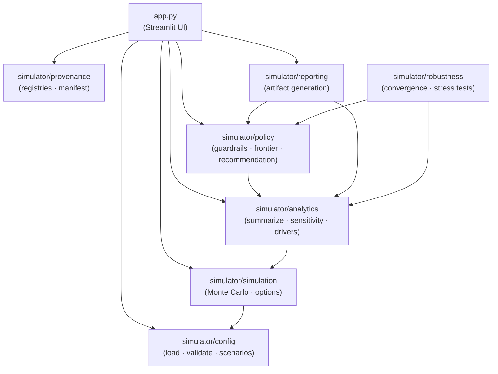

# Product Decision Under Uncertainty
[](https://github.com/tomasz-solis/product-decision-under-uncertainty/actions/workflows/ci.yml)

A decision-analysis case study showing how to frame a platform investment
choice under uncertainty — with a Monte Carlo sampler, an explicit guardrail
policy, a policy frontier, and a full provenance chain from assumptions to
recommendation.

In the current published run, `Stabilize Core` is the recommendation. No
option clears both guardrails, so the policy falls back to expected value and
`Stabilize Core` leads on that measure. Read [NARRATIVE.md](NARRATIVE.md)
for why that result is more interesting than it sounds.

## Scope and evidence

This repo is a **decision-analysis method demonstration**, not a calibrated
model. There is no private company telemetry here and no attempt to back-solve
parameter values from public data. The one public dataset checked in
(HM Land Registry completion rates) is used deliberately as a cross-domain
proxy for `baseline_failure_rate`, not as a like-for-like calibration source.

What this repo demonstrates is the full stack between "here is the assumption"
and "here is the recommendation": elicited assumption provenance, a
joint-world sampler with a Gaussian copula, an explicit guardrail policy, a
policy frontier, descriptive-vs-causal separation in the reporting, and a
calibration contract ready for real evidence when it arrives.

If you are evaluating this as a portfolio sample, read [NARRATIVE.md](NARRATIVE.md)
first. If you are evaluating it as a method to adapt, [METHODOLOGY.md](METHODOLOGY.md)
is the entry point. For the statistical techniques behind the model, see
[METHODS.md](METHODS.md).

- Assumption provenance: [simulator/parameter_provenance.md](simulator/parameter_provenance.md)
- Parameter registry: [simulator/parameter_registry.yaml](simulator/parameter_registry.yaml)
- Non-parameter assumption registry: [simulator/assumption_registry.yaml](simulator/assumption_registry.yaml)

## When to use this vs a standard business case

A standard business case produces one payoff number per option — or three
(base / upside / downside) if the author is careful. That framing assumes the
decision maker is willing to trade expected value against tail risk at a 1:1
ratio.

Reach for this pattern instead when:

- **Tail risk is asymmetric across options.** A lognormal severity on release
  regressions, a downside floor a stakeholder actually cares about, or a
  regret metric that rises faster on some options than others.
- **The options are mutually exclusive.** Opportunity cost is the whole point
  and it needs to be first-class in the analysis.
- **You need to explain what would change the call.** Point estimates cannot
  answer "how far would we have to be wrong for the recommendation to flip?"
  The policy frontier can.
- **The assumptions are elicited, not measured.** Provenance tracking becomes
  the substitute for calibration evidence, and a reviewer can argue against a
  specific assumption rather than the model as a whole.

Stick with a standard DCF business case when you have historical outcomes to
regress against, the options are independent and re-evaluable later, or
stakeholders will push back on Monte Carlo as too academic — sometimes two
sentences and a discount rate is the right tool.

## What is in the repo

- A Monte Carlo simulator with explicit costs, event-based release risk, dependency modeling, and time-aware cashflows
- An encoded decision policy that chooses the recommendation from EV, downside, and regret
- Generated JSON and markdown artifacts for the published case, including guardrail eligibility, a full-option policy frontier, stability diagnostics, and a separate robustness artifact
- A small Streamlit app for exploratory reruns of the same model

## Module map



## Install and run

This repo is `uv` first.

```bash
uv sync --extra dev
```

Generate the published artifacts:

```bash
uv run python scripts/generate_case_study_artifacts.py
```

If you already activated a virtual environment by hand, make sure it is this
project's `.venv`. Otherwise `uv` will warn that the active environment does
not match. In that case, either:

```bash
source .venv/bin/activate
```

or:

```bash
uv run --active python scripts/generate_case_study_artifacts.py
```

Run the app:

```bash
uv run streamlit run app.py
```

Run the tests:

```bash
uv run pytest -q
```

Run the quality checks:

```bash
uv run --extra dev ruff check .
uv run --extra dev mypy app.py simulator tests
```

## Main documents

- Decision narrative: [NARRATIVE.md](NARRATIVE.md) — start here for the decision story
- Methods catalog: [METHODS.md](METHODS.md) — start here for the statistical techniques
- Case study: [CASE_STUDY.md](CASE_STUDY.md)
- Executive summary: [EXECUTIVE_SUMMARY.md](EXECUTIVE_SUMMARY.md)
- Methodology: [METHODOLOGY.md](METHODOLOGY.md)
- Model spec: [simulator/model_spec.md](simulator/model_spec.md)
- Formula appendix: [simulator/formulas.md](simulator/formulas.md)
- Economic terms: [simulator/economic_terms.md](simulator/economic_terms.md)
- Generated artifacts: [artifacts/case_study](artifacts/case_study)

## Evidence workflow (the seam for real data)

This section documents how real evidence would enter the model. Nothing here
is wired to production data — the infrastructure is the demonstration, not
the calibration. One public proxy dataset is checked in to exercise the
pipeline for `baseline_failure_rate`.

- Evidence note: [simulator/data_sources.md](simulator/data_sources.md)
- Public-data staging folder: [data/public/README.md](data/public/README.md)
- Source manifest: [data/public/sources.yaml](data/public/sources.yaml)
- Source manifest template: [data/public/sources.template.yaml](data/public/sources.template.yaml)
- Evidence profiling script: [scripts/profile_public_evidence.py](scripts/profile_public_evidence.py)
- Candidate-builder script: [scripts/build_parameter_candidates.py](scripts/build_parameter_candidates.py)
- Calibration contract: [simulator/calibration_contract.yaml](simulator/calibration_contract.yaml)
- Derived-evidence folder: [artifacts/evidence/README.md](artifacts/evidence/README.md)
- Current evidence-profile artifact: [artifacts/evidence/public_data_profile.json](artifacts/evidence/public_data_profile.json)
- Current evidence-profile note: [artifacts/evidence/public_data_profile.md](artifacts/evidence/public_data_profile.md)
- Current parameter-candidate artifact: [artifacts/evidence/parameter_candidates.json](artifacts/evidence/parameter_candidates.json)
- Current parameter-candidate note: [artifacts/evidence/parameter_candidates.md](artifacts/evidence/parameter_candidates.md)

## Related work

This project is part of a portfolio pair. The companion project,
[public-signals-mislead](https://github.com/tomasz-solis/public-signals-mislead),
explores when public signals (Google Trends, Reddit sentiment) diverge from
actual business outcomes — an earlier study in descriptive analysis and
causal framing. The two projects together trace the arc from post-hoc signal
analysis to prescriptive decision support.
